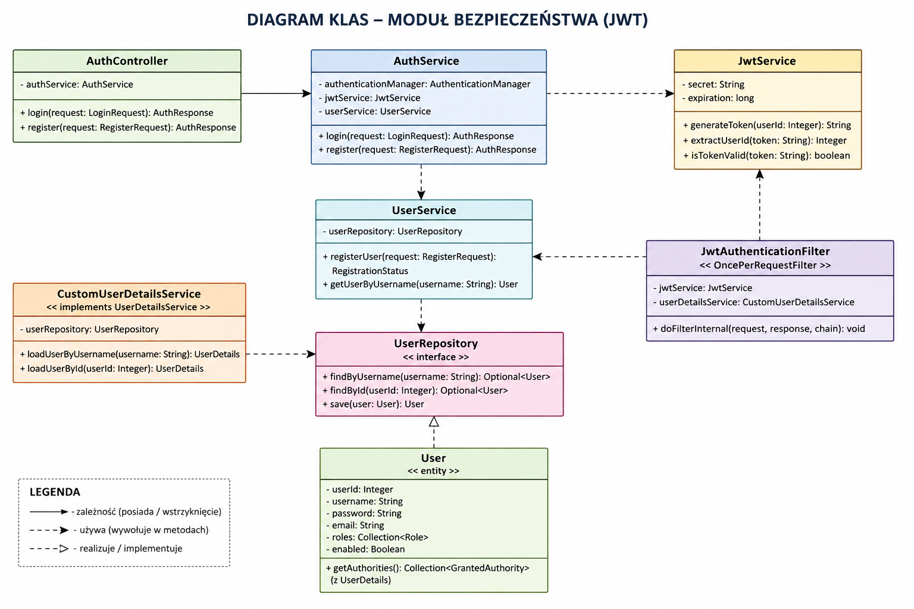
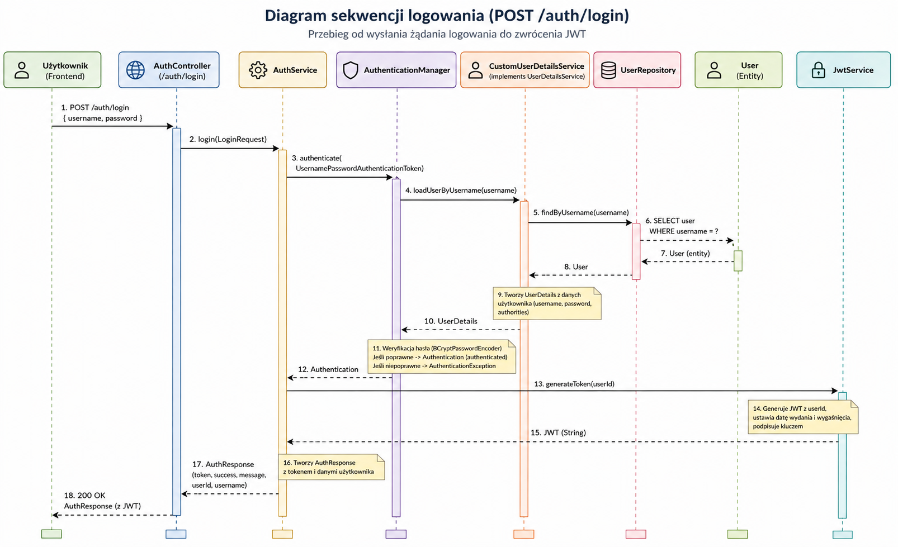
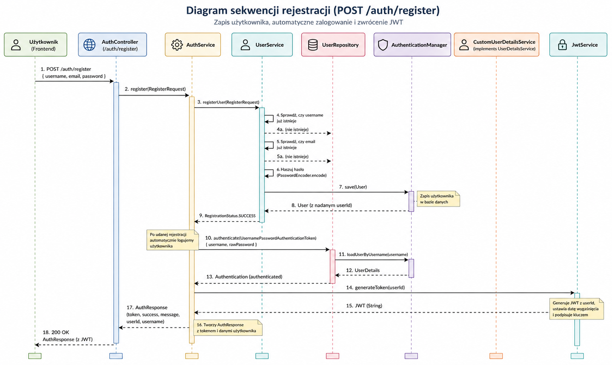
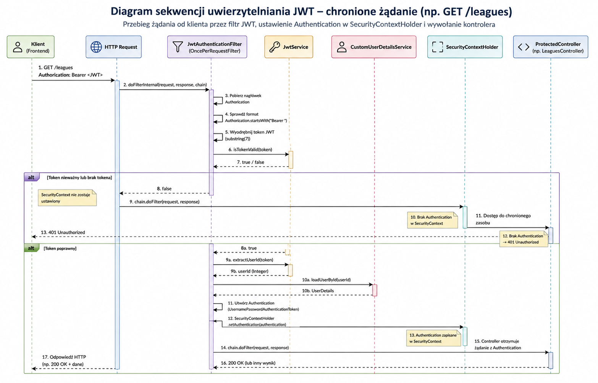
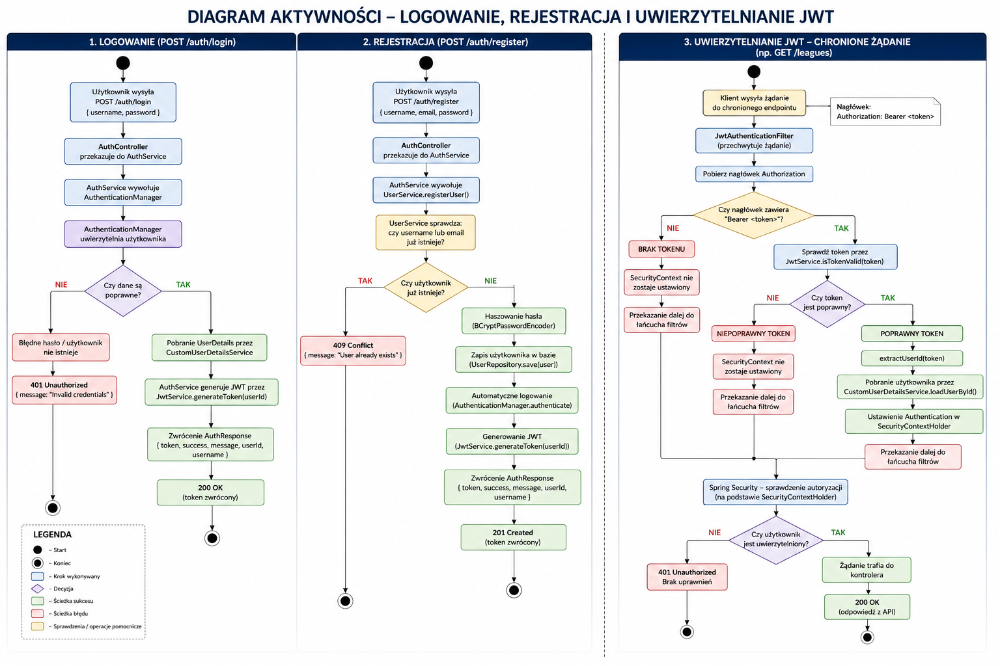
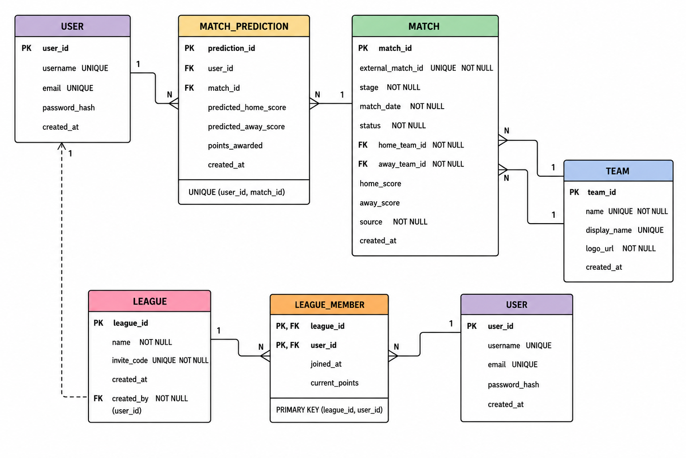

# ⚽ Score Predictor

A modern web application for predicting football match results and competing with friends in private leagues.

The project is being developed using **Java** and **Spring Boot** with a REST API architecture secured by **Spring Security** and **JWT authentication**.

---

# 📖 Overview

Score Predictor allows users to:

- create an account
- securely log in using JWT authentication
- join private leagues
- predict football match results
- automatically synchronize match results
- compete with friends on leaderboards

The application is designed with a layered architecture following Spring Boot best practices.

---

# ✨ Current Features

## Data Management

- Import teams from JSON
- Import matches from JSON
- Prevent duplicate teams
- Prevent duplicate matches

## User Management

- User registration
- User authentication
- Password hashing using BCrypt
- JWT token generation
- JWT authentication filter
- Stateless authentication

---

# 🚀 Planned Features

- Private leagues
- League invitations
- Match predictions
- Prediction deadlines
- Automatic result synchronization
- Points calculation
- Leaderboards
- User profile
- Statistics
- Admin panel

---

# 🛠 Tech Stack

### Backend

- Java 17
- Spring Boot
- Spring Security
- Spring Data JPA
- Hibernate
- JWT (JJWT)
- Jackson

### Database

- Microsoft SQL Server

### Build Tool

- Maven

---

# 🏛 Project Architecture

The application follows a layered architecture.

```
Controller
        │
        ▼
Service
        │
        ▼
Repository
        │
        ▼
Database
```

Business logic is separated from HTTP controllers and data access.

---

# 🔐 Authentication

Authentication is implemented using **JSON Web Tokens (JWT).**

Authentication flow:

1. User sends credentials to:

```
POST /auth/login
```

2. Spring Security authenticates the user.

3. A JWT token is generated.

4. The frontend stores the token.

5. Every protected request includes:

```
Authorization: Bearer <JWT_TOKEN>
```

6. JwtAuthenticationFilter validates the token.

7. The authenticated user is stored inside SecurityContextHolder.

8. Spring Security grants access to protected endpoints.

---

# 📊 UML Diagrams

## Class Diagram

Shows relationships between the authentication classes.



---

## Login Sequence Diagram

Shows the login process from sending credentials to receiving a JWT token.



---

## Registration Sequence Diagram

Shows the complete registration process including automatic login.



---

## JWT Authentication Sequence Diagram

Shows how every protected request is authenticated.



---

## Authentication Activity Diagram

Shows every possible authentication path:

- successful login
- invalid password
- missing token
- invalid token
- valid JWT



---

## Entity Relationship Diagram

Database model used by the application.



---

# 📁 Project Structure

```
score-predictor
│
├── images/
│   ├── Activity_Diagram.png
│   ├── Authentication_Sequence_Diagram.png
│   ├── Class_Diagram.png
│   ├── ERD_Diagram.png
│   ├── Sequence_Diagram_Login.png
│   └── Sequence_Diagram_Register.png
│
├── src/
│
├── pom.xml
│
└── README.md
```

---

# 🔒 Security

Authentication is based on:

- Spring Security
- BCrypt password hashing
- JWT authentication
- Stateless sessions
- Custom JWT filter
- SecurityContextHolder

Passwords are never stored in plain text.

---

# ⚙ REST API

## Authentication

| Method | Endpoint | Description |
|----------|--------------------|---------------------------|
| POST | `/auth/register` | Register a new user |
| POST | `/auth/login` | Authenticate user |

More endpoints will be added as development progresses.

---

# 🎯 Future Improvements

- Refresh Tokens
- Role-based authorization (USER / ADMIN)
- Global exception handling
- Bean Validation
- Docker support
- Integration tests
- Unit tests
- CI/CD pipeline
- Swagger / OpenAPI documentation

---

# ▶ Getting Started

## Clone repository

```bash
git clone https://github.com/your-account/score-predictor.git
```

## Build

```bash
mvn clean install
```

## Run

```bash
mvn spring-boot:run
```

---

# 👨‍💻 Author

**Piotr Wojtczak**

Java Backend Developer Portfolio Project